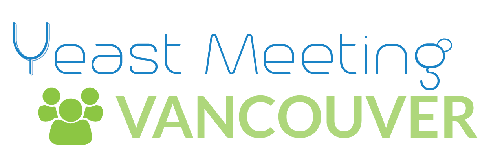

### Our Mission

Our mission is to accelerate scientific discovery by enabling the members of the yeast research community. We believe in a two part approach:

1. Developing research trainees into effective scientists who apply creative problem solving to all challenges, communicate effectively in all contexts, and seek technical proficiency in all aspects of their work.
  
2.	Developing a strong sense of community by minimizing barriers to communication, encouraging collaboration and maintaining an open and sharing culture.

> We apply ourselves by creating events which include the entire community. We mean these to provide a mechanism to distribute original ideas and learning opportunities. We are always seeking these out. We are always trying to learn.

_-your organizers._

### Get Involved

Come to our next meeting!

Have a thought, an idea, an issue ? Join the conversation over on [github](https://github.com/yeastmeeting-vancouver/converse) or on [slack]().

